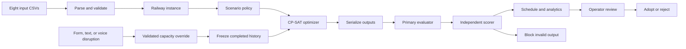

<div align="center">

# NightShift

### Railway possession planning that stays feasible when reality changes

NightShift turns eight railway planning CSVs into a validated possession schedule, an explainable operating picture, and a reviewable recovery plan when the network changes.

[](https://nightshift-hmhb4fs4qa-uc.a.run.app/)
[](https://www.python.org/)
[](https://developers.google.com/optimization/cp/cp_solver)
[](https://fastapi.tiangolo.com/)
[](https://cloud.google.com/run)

[**Launch NightShift**](https://nightshift-hmhb4fs4qa-uc.a.run.app/) · [Judge it in 3 minutes](#judge-nightshift-in-3-minutes) · [See how it works](#how-nightshift-works) · [Run locally](#run-locally) · [Inspect the evidence](#results-you-can-audit)

</div>


## The result

| Public benchmark | Scenario A | Scenario B | Scenario C | Verification |
|---|---:|---:|---:|---|
| **Organizer-accepted penalty** | **0.0** | **0.0** | **0.0** | Feasible, zero hard violations |

The exact submitted archives are retained in [`deliverables/official-zero`](deliverables/official-zero/MANIFEST.json), with hashes and portal observations. Every published penalty term is nonnegative, so an accepted score of 0.0 is the mathematical floor for this public benchmark. This is a precise claim about the organizer's public instance and scoring metric, not a promise that every unseen instance can reach zero.

## Judge NightShift in 3 minutes

The public deployment opens on a ready-to-explore, organizer-accepted Scenario A plan. No API key is needed for the schedule, network, analytics, or replanning workflow.

| Time | What to do | What it demonstrates |
|---:|---|---|
| `0:00–0:30` | Open the [live app](https://nightshift-hmhb4fs4qa-uc.a.run.app/) and move across the 30-week network timeline. | A working control-room view of 54 activities, 14 contracts, and 76 locations. |
| `0:30–1:00` | Open **Work schedule** and inspect an activity's visits, corridor, access type, and completion. | Every visual result traces back to the exported schedule. |
| `1:00–1:25` | Open **Delivery insights** and inspect contract delivery and the penalty breakdown. | The objective is explained rather than shown as an opaque score. |
| `1:25–2:20` | Choose **Report disruption**, reduce one location's capacity for a future week, and calculate a recovery. | Completed history stays frozen while CP-SAT repairs the remaining horizon. |
| `2:20–2:45` | Review changed activities, before/after delivery, and validation; then adopt or reject the candidate. | The operator remains in control of every baseline change. |
| `2:45–3:00` | Open **New plan** to see the eight-file upload, scenario selection, solve progress, and export path. | The same product can run the judges' hidden instance, not only a stored demo. |

For a scripted walkthrough, use the [NightShift 3.0 demo guide](artifacts/nightshift-v3/DEMO_WALKTHROUGH.md).

## Built for the judging rubric

| Judging dimension | NightShift evidence |
|---|---|
| **Problem fit** | Supports Scenarios A, B, and C; exports the required three CSVs; explains delay, excess access, ECLO use, displaced work, and changed contract dates. |
| **Technical execution** | Builds a CP-SAT model from the uploaded eight-file instance, then gates every export through a primary evaluator and an independent raw-CSV score recomputation. |
| **Ease of use** | Gives a works controller one workflow for upload, schedule inspection, delivery analytics, disruption reporting, candidate comparison, approval, and download. |
| **Dynamic replanning bonus** | Applies location/week capacity changes, freezes completed history, repairs the future, and exposes every changed activity before adoption. |
| **Natural-language bonus** | Text and GPT Live voice turn an operator's request into a structured proposal; deterministic code validates it and the solver computes the plan. |

## Why NightShift exists

Railway maintenance teams must fit competing work into scarce nighttime access across shared corridors, platforms, sectors, and buffers. A locally sensible choice can create a distant conflict through closures, predecessors, contract workfronts, or weekly capacity.

NightShift gives each part of that problem to the right system:

- **CP-SAT decides** which combination of visits, weeks, local nights, access types, and sharing groups satisfies the selected scenario.
- **Deterministic validators decide** whether a generated ZIP is safe to release.
- **The interface explains** workload, pressure points, contract delivery, and the consequence of a disruption.
- **The assistant translates intent** into a structured proposal. It never invents the timetable or its score.
- **The operator decides** whether a validated recovery becomes the new baseline.

## The operating experience

| Plan | Understand | Recover | Control |
|---|---|---|---|
| Upload the official eight-file ZIP and choose A, B, or C. | Explore the network by week, search all scheduled visits, and trace delivery by contract. | Report a capacity loss through the form, text, or voice and calculate a future-only repair. | Compare the candidate, inspect validation, adopt it explicitly, and export the required CSVs. |

<table>
  <tr>
    <td width="50%"></td>
    <td width="50%"></td>
  </tr>
  <tr>
    <td align="center"><strong>Trace every planned visit</strong></td>
    <td align="center"><strong>Explain delivery and penalty</strong></td>
  </tr>
</table>

### What the operator gets

- A fresh schedule generated from uploaded railway data, with streaming solver progress and proof metadata.
- A week-by-week network view of work, shared possessions, and capacity pressure.
- A searchable activity schedule with visits, locations, access types, and completion dates.
- Contract delivery analytics, workload distribution, and score decomposition.
- Disruption impact assessment and future-only replanning with before/after comparison.
- Plain-English plan querying and GPT Live voice control when OpenAI credentials are configured.
- A submission ZIP containing exactly `SCHEDULE_ACCESS.csv`, `SCHEDULE_OCCUPANCY.csv`, and `RESULTS.csv`.

## How NightShift works



### The optimization model

NightShift converts lines, stations, sectors, platforms, buffers, weekly supply, contracts, and activities into one canonical instance. Each activity keeps its fixed continuous corridor. The model selects timing and compatible sharing; it does not invent another railway route.

| Decision | Meaning |
|---|---|
| Visit placement | Whether an activity receives a work visit in a given week and local night |
| Access type | Standard possession or ECLO where the scenario permits it |
| Completion | The week in which each activity and contract finishes |
| Sharing | Compatible activities grouped within the same location-week occupation |
| Capacity | Standard occupation groups measured against available supply |
| Excess use | Priced capacity above nominal supply where the scenario allows it |

The web engine supports distinct visits by the same activity within one week. Each visit has its own local night and ECLO choice. That detail matters: the team's earlier one-visit-per-week interpretation prevented the accepted zero-penalty construction.

### Hard constraints and scenario policy

A releasable plan must schedule every required work unit, respect the 30-week horizon, predecessor order, earliest starts, complete activity corridors, closure and buffer interactions, compatible sharing, workfront and allocation limits, scenario capacity rules, and internal consistency across all three output files.

| Scenario | Optimization behavior |
|---|---|
| **A** | Use nominal access and minimize priority-weighted delivery delay. |
| **B** | Enforce the scenario deadline and minimize priced excess access plus ECLO use. |
| **C** | Balance priority-weighted delay, excess access, and ECLO use under its capacity and window rules. |

The engine tries the zero-penalty feasibility problem first. If zero is unavailable within the search budget, it spends the remaining time improving a valid incumbent. A positive result is feasible; it is not described as globally optimal unless the solver proves it.

### Validation before release

Solver status alone is insufficient. NightShift serializes the candidate into the exact submission format, runs the primary evaluator, and independently recomputes feasibility-sensitive score inputs from the raw CSVs. A download is published only when those checks agree.

This catches failures that can hide between a mathematical model and exported bytes: missing or duplicate rows, invalid local nights, stale completion summaries, mismatched scenarios, double-counted work, and serialization mistakes.

## Replanning with a human in control

1. The active validated schedule becomes the baseline.
2. The operator identifies a disrupted location, affected week range, and revised capacity.
3. The backend validates those fields and derives affected activities from the active schedule.
4. Visits before the incident week remain fixed as completed history.
5. CP-SAT solves the remaining horizon under the new capacity.
6. The evaluator and independent scorer gate the candidate.
7. The interface shows moved activities, changed contract dates, and before/after penalties.
8. The active baseline changes only when the operator selects **Adopt plan**.

The current recovery is validated for feasibility, but NightShift does not claim it always has the mathematically smallest number of changes. The API keeps `minimum_change_proven` false until that secondary objective is formally certified.

### Where GPT Live fits

The language model improves access to the system without becoming a scheduling authority.

- It can answer questions about the active plan and convert a disruption statement into proposed fields.
- The backend checks identifiers, weeks, capacities, and referenced activities against the active instance.
- Affected work is recomputed from schedule data instead of trusting model-generated names.
- CP-SAT generates the candidate; deterministic code validates the result and score.
- Every baseline-changing action remains visible and requires human adoption.
- API credentials stay server-side. The browser receives only short-lived session material for voice.

## Results you can audit

### Organizer-accepted public benchmark

| Scenario | Feasible | Penalty | Delay | Excess access | ECLO | Exact archive |
|---|---:|---:|---:|---:|---:|---|
| A | Yes | **0.0** | 0 | 0 | 0 | [`A.zip`](deliverables/official-zero/A.zip) |
| B | Yes | **0.0** | 0 | 0 | 0 | [`B.zip`](deliverables/official-zero/B.zip) |
| C | Yes | **0.0** | 0 | 0 | 0 | [`C.zip`](deliverables/official-zero/C.zip) |

The [manifest](deliverables/official-zero/MANIFEST.json) records archive and member hashes, official feasibility, score components, portal run identifiers, and probe provenance. The [controlled-probe report](artifacts/controlled-probes-2026-09-19/RESULTS.md) preserves the full four-step sequence.

### Why 0.0 is optimal for this benchmark

The published objective is a sum of nonnegative delay, excess-access, and ECLO penalties. Therefore every valid score is at least zero. The organizer portal accepted a feasible witness with score zero in each scenario, so the optimum of the published public-instance metric is exactly zero.

That proof is deliberately narrow. It establishes the numeric floor for the accepted public files and metric. It does not prove that every hidden instance can reach zero, that a bounded solve always finds the global optimum, or that the CSV format captures every real-world dispatching concern.

### Evidence ladder

| Level | Evidence | What it establishes |
|---:|---|---|
| 1 | CP-SAT solution status | The candidate satisfies the encoded mathematical model. |
| 2 | Primary evaluator | Serialized rows satisfy the implemented scheduling rules. |
| 3 | Independent raw-CSV scoring | Feasibility inputs, score components, and summaries agree through another code path. |
| 4 | Regression and adversarial tests | Known bugs, malformed inputs, ordering changes, and replanning behavior are exercised. |
| 5 | Organizer portal | The authoritative portal accepted the retained public-instance bytes and reported 0.0. |

Current local verification: **214 tests passed, 137 constraint subtests passed, and one historical fixture was skipped**. The skip preserves a fixture based on the earlier closure interpretation instead of silently rewriting the record.

### Known semantic boundary

The [adversarial self-audit](artifacts/adversarial-self-audit-2026-09-19/REPORT.md) found that accepted CSV rows do not by themselves prove one globally consistent physical-night assignment. Similar contradictions appear in the organizer sample, so this may be the validator's intended local accounting abstraction. NightShift reports organizer acceptance and operational interpretation as separate claims. A real railway deployment would require the infrastructure owner to settle that boundary and complete independent safety assurance.

## The journey: from a plausible model to the right one

The strongest result did not come from adding more search time. It came from testing an assumption shared by every implementation.

1. **Translate the brief.** We mapped the eight input tables into corridors, supply, contracts, predecessors, closures, sharing, workfronts, scenario policies, and executable validation rules.
2. **Build independent checks.** CP-SAT, a primary evaluator, and a raw-CSV scorer agreed on reproducible feasible schedules, but their best penalties remained positive.
3. **Interrogate real violations.** Replaying teammate submissions against portal diagnostics exposed a closure endpoint-platform omission and reinforced that a low local score was not enough.
4. **Run controlled probes.** Under a four-upload budget, we changed one behavior at a time. The portal accepted repeated visits by one activity in the same week when they used distinct local nights.
5. **Correct the shared assumption.** Removing the one-visit-per-week restriction produced a zero-penalty schedule that the portal accepted in C, A, and B.
6. **Rebuild the product.** The live engine now models distinct visits, separates stored references from fresh computation, streams solve evidence, and makes recovery plans reviewable before adoption.

The lesson was uncomfortable and useful: independent programs are not independent evidence when they inherit the same interpretation. The repository therefore preserves failed paths, exact probes, hashes, and an adversarial audit alongside the final result.

## Run locally

### Prerequisites

- Git
- Python 3.11 or newer
- Approximately 4 GiB RAM for comfortable local solving

### Install and start

```bash
git clone https://github.com/13shreyansh/nebula-ps1-knowledge-base.git
cd nebula-ps1-knowledge-base

# The organizer's public instance is kept as a separate checkout.
git clone --depth 1 \
  https://github.com/aochinwen/NebulaX-Hackathon-ProblemStatement.git \
  current-problem-statement

python3.11 -m venv .venv
source .venv/bin/activate
python -m pip install --upgrade pip
pip install -e '.[test]'

uvicorn nebula_ps1.web:app --host 127.0.0.1 --port 8080 --reload
```

Open [http://127.0.0.1:8080](http://127.0.0.1:8080). NightShift automatically discovers the public instance at `current-problem-statement/PS1/01_data`.

### Optional text and voice assistant

Create `.env.local` only if you want assistant features:

```bash
OPENAI_API_KEY=your_server_side_key
OPENAI_TEXT_MODEL=gpt-5.6-terra
OPENAI_VOICE_MODEL=gpt-live-1
```

`.env.local` is ignored by Git. Scheduling, validation, visualization, and replanning work without an OpenAI key.

### Run the checks

```bash
pytest -q
```

## Technical reference

<details>
<summary><strong>Input and output contract</strong></summary>

NightShift accepts one ZIP with exactly these files at its root:

```text
01_LINES.csv
02_STATIONS.csv
03_SECTORS.csv
04_LOCATION_SUPPLY.csv
05_BUFFER_LOCATION.csv
06_PARAMETERS.csv
07_PROJECT_DETAILS.csv
08_ACTIVITY_DETAILS.csv
```

The upload boundary rejects missing or duplicate files, nested paths, directories, symlinks, encrypted archives, oversized members, invalid schemas, and unsafe extraction patterns. Processing occurs in an isolated temporary workspace. The current limits are 32 MiB uploaded, 64 MiB extracted, and 32 MiB for the generated result archive.

Every successful export contains exactly:

```text
SCHEDULE_ACCESS.csv
SCHEDULE_OCCUPANCY.csv
RESULTS.csv
```

</details>

<details>
<summary><strong>API surface</strong></summary>

| Method | Route | Purpose |
|---|---|---|
| `GET` | `/api/health` | Process liveness |
| `GET` | `/api/readiness` | Data, solver, and reference readiness |
| `GET` | `/api/example` | Public example input and metadata |
| `GET` | `/api/reference/{scenario}` | Explicit organizer-accepted reference archive |
| `POST` | `/api/solve` | Compute and return a fresh schedule |
| `POST` | `/api/solve-stream` | Compute with server-sent progress events |
| `POST` | `/api/replan-stream` | Apply a disruption and stream a recovery solve |
| `GET` | `/api/assistant/status` | Assistant configuration and availability |
| `POST` | `/api/assistant` | Plan query or structured proposal |
| `POST` | `/api/voice/session` | Short-lived OpenAI Live session credentials |

</details>

<details>
<summary><strong>Command-line tools</strong></summary>

```bash
nebula-ps1 --help
nebula-ps1 inspect --data DATA_DIR --submission OUTPUT_DIR --scenario C
nebula-ps1 audit-score --data DATA_DIR --submission OUTPUT_DIR
nebula-ps1 solve-flexible-relaxation \
  --data DATA_DIR \
  --output OUTPUT_DIR \
  --scenario C \
  --time-limit 180
```

The CLI also retains research and repair workflows from development. The web engine is the current path for fresh scheduling and replanning; accepted archives under `deliverables/official-zero` are immutable evidence.

</details>

<details>
<summary><strong>Technology stack</strong></summary>

| Layer | Technology | Role |
|---|---|---|
| Optimization | Python, Google OR-Tools CP-SAT | Discrete scheduling, feasibility, and scenario objectives |
| Domain model | Typed Python modules | Parsing, topology, closures, policies, output, and validation |
| API | FastAPI, Uvicorn | Solving, progress streaming, replanning, assistant, and readiness |
| Interface | HTML, CSS, vanilla JavaScript | Lightweight operator console |
| Conversational layer | OpenAI Responses API and Live WebRTC | Plan questions, structured proposals, and voice |
| Deployment | Docker, Google Cloud Run | Public HTTPS service with bounded solver concurrency |
| Quality | pytest, independent scorer, retained artifacts | Regression protection and inspectable evidence |

</details>

<details>
<summary><strong>Cloud Run deployment</strong></summary>

The repository includes a production `Dockerfile`:

```bash
gcloud run deploy nightshift \
  --source . \
  --region us-central1 \
  --port 8080 \
  --cpu 2 \
  --memory 4Gi \
  --timeout 900 \
  --concurrency 8 \
  --max-instances 2 \
  --set-env-vars \
NEBULA_SOLVER_WORKERS=2,NEBULA_SOLVER_CONCURRENCY=1,NEBULA_SOLVE_SECONDS=180
```

Configure OpenAI values through Secret Manager or the Cloud Run service configuration. See [`CLOUD_HOSTING.md`](CLOUD_HOSTING.md) for verification, concurrency, and rollback notes.

</details>

## Repository guide

```text
.
├── src/nebula_ps1/             Model, solvers, validators, API, and interface
├── tests/                      Unit, regression, web, solver, and replan tests
├── deliverables/
│   ├── official-zero/          Exact organizer-accepted A/B/C archives
│   ├── local-validator/        Portable validator and verification bundle
│   └── frontend-handoff/       Integration contract and packaged solver
├── artifacts/
│   ├── controlled-probes-2026-09-19/   Official experiment record
│   ├── adversarial-self-audit-2026-09-19/  Falsification report and scripts
│   ├── friend-portal-audit-2026-09-19/     Teammate violation replay
│   └── nightshift-v3/          Product demo and cloud verification
├── docs/assets/                Product screenshots
├── Dockerfile                  Production container
├── pyproject.toml              Package and dependency definition
├── CLOUD_HOSTING.md            Cloud Run runbook
├── EXPERIMENT_LEDGER.md        Chronological optimization experiments
├── OFFICIAL_VALIDATOR_LEDGER.md Portal evidence and uncertainty register
└── SELF_INSPECTION_LOG.md      Claims, checks, and corrections
```

## Security and production boundaries

Uploads are size-limited and inspected before extraction. ZIP paths, encryption, symlinks, directories, duplicate names, and unexpected files are rejected. Runs use isolated temporary directories; exports contain only the required output files; solver concurrency is bounded; and assistant credentials remain server-side.

NightShift is a hackathon decision-support prototype. A railway deployment would additionally require organizational authentication, role-based approval, durable signed audit logs, monitoring, retention policy, integration with authoritative asset systems, and infrastructure-owner safety certification.

Current engineering boundaries are tracked openly:

- Bounded search can return a feasible positive incumbent without proving optimality.
- Replanning preserves completed history but does not yet prove minimum disruption.
- The public benchmark is one network; structurally different frozen holdouts are the next generalization test.
- Physical-night semantics require a domain-owner decision before safety-critical deployment.
- The live prototype keeps results in the active browser workflow rather than a persistent authenticated workspace.

## Documentation and audit trail

- [Official problem statement](https://github.com/aochinwen/NebulaX-Hackathon-ProblemStatement/blob/main/PS1/PS1_README.md)
- [NightShift 3.0 demo walkthrough](artifacts/nightshift-v3/DEMO_WALKTHROUGH.md)
- [Controlled official probes](artifacts/controlled-probes-2026-09-19/RESULTS.md)
- [Official zero-result manifest](deliverables/official-zero/MANIFEST.json)
- [Public-instance optimality audit](artifacts/public-optimality-audit-2026-09-19/OPTIMALITY_PROOF.md)
- [Adversarial self-audit](artifacts/adversarial-self-audit-2026-09-19/REPORT.md)
- [Teammate portal-violation audit](artifacts/friend-portal-audit-2026-09-19/REPORT.md)
- [Official validator ledger](OFFICIAL_VALIDATOR_LEDGER.md)
- [Experiment ledger](EXPERIMENT_LEDGER.md)
- [Self-inspection log](SELF_INSPECTION_LOG.md)
- [Cloud hosting and verification](CLOUD_HOSTING.md)

## Acknowledgements

NightShift was built for NebulaX Hackathon Problem Statement 1. It uses the organizer's public specification and instance, Google OR-Tools for constraint programming, FastAPI for the service layer, OpenAI APIs for the optional conversational experience, and Google Cloud Run for deployment.

Questions, review findings, and reproducible counterexamples are welcome through [GitHub Issues](https://github.com/13shreyansh/nebula-ps1-knowledge-base/issues).

---

<div align="center">

### A complex railway plan should still be easy to inspect, repair, and question.

[**Open NightShift →**](https://nightshift-hmhb4fs4qa-uc.a.run.app/)

</div>
