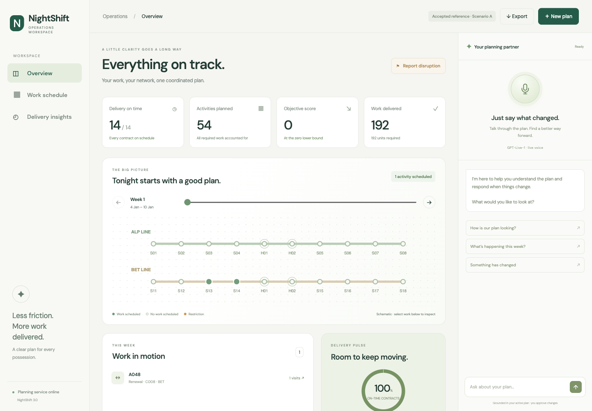
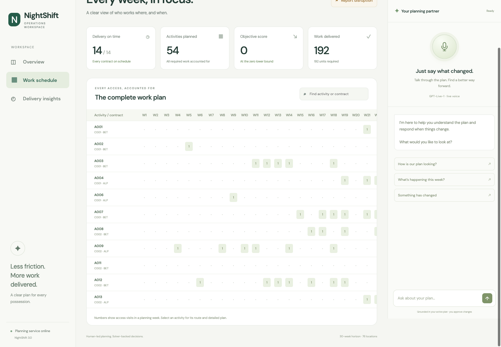
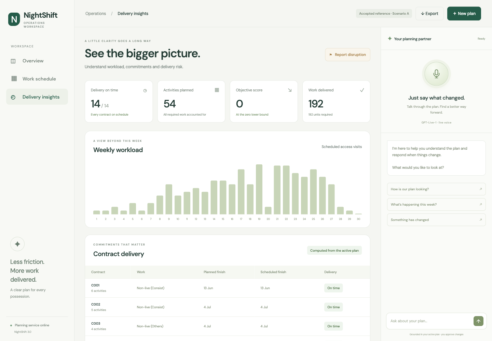
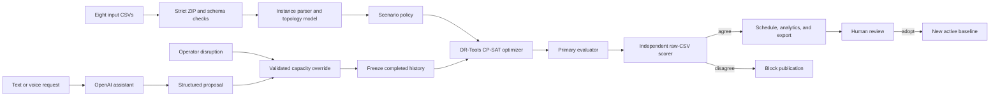

<div align="center">

# NightShift

### Railway possession planning that stays feasible when reality changes

NightShift turns eight railway planning CSVs into a validated possession schedule, an explainable operating picture, and a reviewable recovery plan when the network changes.

[](https://nightshift-hmhb4fs4qa-uc.a.run.app/)
[](https://www.python.org/)
[](https://developers.google.com/optimization/cp/cp_solver)
[](https://fastapi.tiangolo.com/)
[](https://cloud.google.com/run)

[Launch the live app](https://nightshift-hmhb4fs4qa-uc.a.run.app/) · [Take the 90-second tour](#try-nightshift-in-90-seconds) · [Understand the architecture](#architecture) · [Run it locally](#run-locally) · [Inspect the evidence](#results-and-evidence)

</div>



> **Verified public-instance result:** the exact retained archives in [`deliverables/official-zero`](deliverables/official-zero/MANIFEST.json) were accepted by the organizer portal as feasible with a **0.0 penalty in Scenarios A, B, and C**. Since every published penalty term is nonnegative, 0.0 is the mathematical floor of that metric. This is evidence for the published public instance, not a claim that every hidden or future instance will solve to zero.

## Why NightShift exists

Railway maintenance teams need enough nighttime access to complete work safely and on time. Several contracts may need the same corridor, platform, sector, or buffer location in the same week. A locally sensible decision can create a conflict elsewhere through closures, predecessor relationships, workfront limits, or shared capacity.

A spreadsheet can describe the work, but it cannot reliably reason across all of those interactions. A language model can explain a plan, but it should not invent a safety-critical timetable. NightShift separates those jobs:

- **CP-SAT decides** which feasible combination of visits, weeks, access types, and sharing groups best satisfies the selected scenario.
- **Deterministic validation decides** whether an output may be released.
- **The operations interface explains** workload, pressure points, contract delivery, and the effect of a proposed disruption.
- **The AI assistant translates intent** into a structured proposal. The backend validates the proposal and computes its actual impact before an operator can adopt anything.

The result is a planning workspace for Possession Planning Officers and operations teams, not a black-box timetable generator.

## At a glance

| Public planning instance | Verified value |
|---|---:|
| Planning horizon | 30 weeks |
| Contracts | 14 |
| Activities | 54 |
| Required standard work units | 192 |
| Network locations | 76 |
| Explicit predecessor links | 6 |
| Organizer-accepted Scenario A penalty | **0.0** |
| Organizer-accepted Scenario B penalty | **0.0** |
| Organizer-accepted Scenario C penalty | **0.0** |

## Try NightShift in 90 seconds

1. Open the [live NightShift deployment](https://nightshift-hmhb4fs4qa-uc.a.run.app/). The organizer-accepted Scenario A reference plan is ready to explore immediately.
2. Move the week control across the 30-week horizon. The network view shows the live footprint, shared possessions, and weekly capacity pressure.
3. Open **Work schedule** to search by activity or contract and inspect every planned visit, location, access type, and completion date.
4. Open **Delivery insights** to see contracts on time, activity progress, workload distribution, and the score decomposition.
5. Select **Report disruption** and reduce capacity at a location and week. NightShift preserves the completed past, solves the remaining problem, and presents the changed activities and before/after score.
6. Ask the assistant a plan question by text or voice. For example: “Capacity at this platform is unavailable in week 12. What changes?” The assistant creates a proposal, while the scheduling engine computes the plan.
7. Review the candidate. The active baseline changes only when the operator explicitly adopts it. Downloaded output contains exactly the three required submission CSVs.

No API key is needed to explore the published reference plan, analytics, schedule, or network view. Voice and free-form assistant features require server-side OpenAI configuration.

## What it does

| Capability | What the operator gets |
|---|---|
| Fresh schedule generation | Upload the eight required CSVs and select Scenario A, B, or C. NightShift builds a new CP-SAT model from those files. |
| Scenario-aware optimization | Hard constraints and penalty terms change with the selected operating scenario. |
| Safety gate | A candidate must pass the primary evaluator and an independent score recomputation before it is downloadable. |
| Search observability | Streaming progress shows solver status, incumbent objective, bound, model size, runtime, and validation state. |
| Network visualization | Inspect the planned footprint and possession pressure by week and location. |
| Delivery analytics | Trace contract completion, delayed work, excess use, ECLO use, and activity-level details. |
| Disruption replanning | Change capacity for a location and week, freeze completed history, solve the remaining horizon, and compare the candidate with the baseline. |
| Natural-language querying | Ask questions about the active plan without reading raw CSVs. |
| Voice control | Use an OpenAI Live WebRTC session to discuss the plan and prepare a disruption proposal. |
| Human approval | The assistant may propose and the solver may calculate, but only the operator can adopt a new active plan. |
| Submission export | Download a ZIP containing `SCHEDULE_ACCESS.csv`, `SCHEDULE_OCCUPANCY.csv`, and `RESULTS.csv`. |

<table>
  <tr>
    <td width="50%"></td>
    <td width="50%"></td>
  </tr>
  <tr>
    <td align="center"><strong>Trace every planned visit</strong></td>
    <td align="center"><strong>Explain delivery and penalty</strong></td>
  </tr>
</table>

## Architecture



### Technology stack

| Layer | Technology | Role |
|---|---|---|
| Optimization | Python, Google OR-Tools CP-SAT | Discrete scheduling, feasibility, and scenario objectives |
| Domain model | Typed Python modules | CSV parsing, topology, closures, policies, outputs, and validation |
| API | FastAPI, Uvicorn | Solving, streaming progress, replanning, assistant, readiness, and references |
| Interface | HTML, CSS, vanilla JavaScript | Fast operator console without a heavy client framework |
| Conversational layer | OpenAI Responses API and Live WebRTC | Plan questions, structured disruption proposals, and voice interaction |
| Deployment | Docker, Google Cloud Run | Public HTTPS service with bounded concurrency and isolated temporary workspaces |
| Quality | pytest, independent scorer, retained audit artifacts | Regression protection and inspectable evidence |

## From CSVs to a trustworthy plan

### 1. A strict input contract

NightShift accepts one ZIP with exactly these eight files at its root:

```text
01_LINES.csv
02_STATIONS.csv
03_SECTORS.csv
04_LOCATION_SUPPLY.csv
05_BUFFER_LOCATION.csv
06_PARAMETERS.csv
07_PROJECT_DETAILS.csv
08_ACTIVITY_DETAILS.csv
```

The upload boundary rejects missing or duplicate files, nested paths, directories, symlinks, encrypted archives, oversized members, invalid schemas, and unsafe extraction patterns. Processing happens in a temporary workspace. The current limits are 32 MiB uploaded, 64 MiB extracted, and 32 MiB for a generated result archive.

### 2. A normalized railway model

The parser converts lines, stations, sectors, platforms, buffers, weekly supply, contracts, and activities into one canonical instance. Each activity keeps its fixed continuous corridor. Optimization selects its timing and compatible sharing; it does not invent another railway route.

Before solving, NightShift derives:

- the complete footprint of every activity;
- weekly standard access supply by location;
- closure, buffer, and live-line effects;
- contract/type access limits and local night mappings;
- predecessor relationships and earliest starts;
- workfront and allocation limits;
- scenario-specific deadlines, capacity behavior, and penalty weights.

### 3. A CP-SAT scheduling model

The engine represents the schedule with discrete decision variables rather than generated prose.

| Decision | Meaning |
|---|---|
| Visit placement | Whether an activity receives a work visit in a given week and local night |
| Access type | Standard possession or ECLO, where the scenario permits it |
| Work completion | The week in which the activity and its contract finish |
| Sharing assignment | Compatible activities grouped within the same location-week occupation |
| Capacity use | Standard occupation groups compared with available supply |
| Excess use | Capacity above nominal supply where the scenario permits a priced excess |

The current web engine supports distinct visits by the same activity within one week. Each visit has its own local night and ECLO choice. This corrects the earlier one-visit-per-week interpretation that prevented the team from finding the accepted zero-penalty construction.

### 4. Hard constraints

A plan is eligible for release only when it satisfies the implemented hard rules, including:

- every activity receives its exact required workload;
- visits remain inside the planning horizon and respect earliest starts;
- predecessors finish before dependent work begins;
- every visit occupies the activity's complete required corridor;
- incompatible closures, buffers, platforms, sectors, and live-line effects do not overlap;
- sharing groups contain only compatible work;
- weekly capacity, contract allocation, workfront, and possession-mix rules hold for the scenario;
- local night values, sequences, ECLO windows, and output summaries remain internally consistent;
- a replanned schedule does not rewrite completed history before the incident week.

### 5. Scenario-specific objectives

| Scenario | Optimization behavior |
|---|---|
| A | Use nominal access and minimize priority-weighted delivery delay. |
| B | Enforce the scenario deadline and minimize priced excess access plus ECLO use. |
| C | Balance priority-weighted delay, excess access, and ECLO use under its capacity and window rules. |

The web solver tries the zero-penalty feasibility problem first. If zero is unavailable within the search, it spends the remaining time optimizing the permitted trade-offs. A valid zero proves the floor of the nonnegative implemented objective. A positive incumbent is a feasible result, not automatically a proof of global optimality.

### 6. Two checks before release

Solver status alone is not enough. NightShift serializes the candidate into the exact output CSV format, runs the primary evaluator, then independently recomputes feasibility-sensitive score inputs from the raw CSVs. It publishes a ZIP only when those checks agree.

This gate catches mistakes that can hide between an internal model and an exported file: missing rows, duplicate work credit, mismatched completion dates, incorrect scenario labels, stale score summaries, and serialization errors.

## Replanning when the railway changes

The replanning flow is designed around an operator question: **what changed, why, and what must I approve?**

1. The active validated plan becomes the baseline.
2. The operator identifies the disrupted location, week, and revised capacity through the form, text, or voice.
3. The backend validates the location and horizon, applies the capacity override, and computes the affected activities from the active plan.
4. Visits before the incident week are preserved as completed history.
5. CP-SAT solves the remaining horizon under the changed capacity.
6. The same evaluator and independent scorer gate the candidate.
7. The UI presents moved activities, changed contract dates, and before/after penalty components.
8. The candidate stays separate until the operator chooses **Adopt plan**.

NightShift currently reports a valid repaired candidate, but it does not claim that the candidate has the mathematically smallest possible number of changes. `minimum_change_proven` remains false until that secondary objective is formally proven.

## How the assistant stays in its lane

Natural language makes the product easier to operate, but it is not the source of scheduling truth.

- The assistant can explain the active plan and convert a disruption statement into structured fields.
- Location identifiers, weeks, capacities, and referenced activities are checked against the active instance.
- The backend recomputes affected activities instead of trusting names generated by the model.
- The assistant does not fabricate a schedule, score, validator result, or successful adoption.
- Any action that changes the plan remains a visible proposal until the operator calculates and adopts it.
- API credentials stay on the server and are never embedded in browser JavaScript or a repository file.

This boundary lets NightShift combine conversational usability with deterministic operational control.

## How we built it

The final system came from repeated attempts to disprove our own interpretation, not from one clean solver run.

### Phase 1: Translate the brief into executable rules

We mapped the organizer's CSVs into railway locations, continuous activity footprints, supply, contracts, predecessors, closure effects, sharing, workfronts, and scenario policies. We wrote a local evaluator and a separate scorer so a promising objective could not bypass feasibility.

### Phase 2: Build protected optimization pipelines

The first CP-SAT implementation used safe fallbacks, closure separation, pruning, multiple seeds, shuffled inputs, and restricted improvement neighborhoods. It found reproducible feasible schedules, but the best penalties were still positive. At that point we had multiple implementations that agreed with each other, which looked reassuring and was ultimately misleading.

### Phase 3: Treat portal violations as experimental evidence

We replayed teammate submissions and compared their portal diagnostics with our checker. That exposed a closure endpoint-platform omission and showed why a score alone was not enough. We retained exact uploaded ZIPs and diagnostics so each rule hypothesis could be checked against bytes rather than memory.

### Phase 4: Use four controlled probes

With a strict four-upload budget, we changed one behavior at a time. A repeated same-week visit was accepted. We then replaced the remaining ECLO visits with standard visits using distinct local nights. The portal accepted the resulting schedule at 0.0 in Scenario C, then accepted the same schedule under Scenarios A and B.

The experiment disproved the assumption that each activity could have at most one visit per week. That assumption had been shared by the optimizer, evaluator, independent scorer, and a separate proof model. Multiple code paths were independent in implementation but correlated in interpretation.

### Phase 5: Rebuild the product around the corrected model

We updated the live scheduling engine to support repeated visits, integrated the closure correction, removed public-input result substitution from the fresh solve path, added streaming proof and validation metadata, and kept organizer-accepted archives behind explicit reference controls.

### Phase 6: Turn the solver into an operating experience

The result became NightShift 3.0: a network control view, searchable schedule, delivery analytics, disruption replanning, candidate comparison, downloadable outputs, and a voice-capable assistant whose proposals still pass through deterministic scheduling and human review.

## Challenges and how we overcame them

| Challenge | What failed | What changed |
|---|---|---|
| Ambiguous weekly access semantics | We encoded one visit per activity per week in every checker and model. | We used controlled portal probes, retained the exact evidence, and rebuilt visits as distinct week/night decisions. |
| Correlated confidence | Independent implementations agreed because they inherited the same assumption. | We now separate implementation independence from assumption independence and keep an explicit adversarial audit. |
| Closure propagation | The original checker missed two own-line buffer endpoint-platform effects visible in teammate diagnostics. | We reconstructed the cases from exact archives, added the endpoint behavior, and retained the replay report. |
| Large combinatorial search | Closure, sharing, capacity, deadlines, and workfronts couple many decisions. | We use zero-first CP-SAT search, safe incumbents, scenario policies, bounded workers, and publication gates. |
| Scarce official attempts | Blind optimization through the portal would waste the only authoritative experiments. | We predeclared a four-probe sequence, isolated hypotheses, recorded before/after states, and preserved the last accepted result. |
| Raw solver output was hard to operate | CSVs and objective values did not tell a planner what changed. | We built a weekly network, activity trace, contract insights, score decomposition, and candidate comparison. |
| Language-model overreach | A conversational model could guess affected work or imply that a plan changed. | The model only produces a proposal. The backend validates fields, computes impact, calls CP-SAT, and waits for explicit adoption. |
| Replanning trust | A feasible recovery can still be operationally disruptive. | We freeze completed history and show every changed activity and delivery effect before adoption. Formal minimum-change proof remains disclosed as future work. |
| Long solves in a live service | One compute-heavy request could make the interface appear unavailable. | Cloud Run uses bounded request concurrency, an application solve semaphore, streaming progress, and separate health/readiness endpoints. |

## What we deliberately did not do

- We did not train a model to imitate one public schedule. The scheduling path is an explicit CP-SAT model with programmed constraints.
- We did not let an LLM generate or validate the timetable.
- We did not present a stored public result as a fresh solve. Reference archives and computed runs are separate API and UI paths.
- We did not hide failed interpretations. Earlier scores, teammate violations, controlled probes, and the adversarial audit remain in the repository.
- We did not claim universal optimality from one public 0.0 result. Hidden or structurally different inputs may need positive penalty or exceed the time budget.
- We did not equate portal acceptance with complete proof of real-world dispatchability. The occupancy format and physical-night meaning still require organizer clarification, documented below.

## Results and evidence

### Organizer-accepted public results

| Scenario | Feasible | Official penalty | Delay | Excess access | ECLO | Exact archive |
|---|---:|---:|---:|---:|---:|---|
| A | Yes | **0.0** | 0 | 0 | 0 | [`A.zip`](deliverables/official-zero/A.zip) |
| B | Yes | **0.0** | 0 | 0 | 0 | [`B.zip`](deliverables/official-zero/B.zip) |
| C | Yes | **0.0** | 0 | 0 | 0 | [`C.zip`](deliverables/official-zero/C.zip) |

The [official-zero manifest](deliverables/official-zero/MANIFEST.json) records the observation time, remaining attempts, archive SHA-256 hashes, member hashes, official feasibility, score components, and probe provenance. The final portal state and the full four-step sequence are preserved in the [controlled-probe report](artifacts/controlled-probes-2026-09-19/RESULTS.md).

### Why 0.0 is the lowest possible portal penalty

The published objective adds only nonnegative quantities: positive delay, excess capacity, and ECLO counts multiplied by positive weights. Therefore every valid score is at least zero. The portal accepted a feasible witness with score zero in each scenario. The public-instance optimum under that portal metric is consequently exactly zero.

This proof has a narrow and useful scope. It proves the numeric floor for the accepted public instance and metric. It does not prove that every operational interpretation of co-sharing corresponds to a physical timetable, or that unseen instances can always reach zero.

### Evidence ladder

| Level | Evidence | What it establishes |
|---|---|---|
| 1 | CP-SAT solution status | A candidate satisfies the encoded mathematical model. |
| 2 | Primary evaluator | Exported rows satisfy the implemented scheduling rules. |
| 3 | Independent raw-CSV scoring | Score inputs and summaries agree through a separate code path. |
| 4 | Regression and adversarial tests | Known bugs, malformed inputs, ordering changes, and replanning behavior are exercised. |
| 5 | Organizer portal acceptance | Exact retained public-instance bytes were accepted and scored by the authoritative portal. |

### Known boundary

The [adversarial self-audit](artifacts/adversarial-self-audit-2026-09-19/REPORT.md) found that the accepted CSV representation does not by itself prove a globally consistent physical-night assignment. Similar contradictions appear in the organizer sample, so this may reflect the intended local accounting abstraction rather than a contestant-only exploit. We report the accepted portal result and the operational ambiguity separately. A production railway deployment would require the infrastructure owner to settle that semantic boundary and provide safety assurance beyond a hackathon validator.

## Run locally

### Prerequisites

- Git
- Python 3.11 or newer
- Approximately 4 GiB RAM for comfortable local solving

### 1. Clone NightShift

```bash
git clone https://github.com/13shreyansh/nebula-ps1-knowledge-base.git
cd nebula-ps1-knowledge-base
```

### 2. Fetch the official public instance

The official problem-statement repository is intentionally kept outside this repository's tracked source tree.

```bash
git clone --depth 1 \
  https://github.com/aochinwen/NebulaX-Hackathon-ProblemStatement.git \
  current-problem-statement
```

The app will find the public CSVs at `current-problem-statement/PS1/01_data`.

### 3. Install

```bash
python3.11 -m venv .venv
source .venv/bin/activate
python -m pip install --upgrade pip
pip install -e '.[test]'
```

### 4. Configure optional assistant features

Create `.env.local` only if you want text and voice assistance:

```bash
OPENAI_API_KEY=your_server_side_key
OPENAI_TEXT_MODEL=gpt-5.6-terra
OPENAI_VOICE_MODEL=gpt-live-1
```

`.env.local` is ignored by Git. Schedule generation, validation, visualization, and replanning remain available without an OpenAI key.

### 5. Start the app

```bash
uvicorn nebula_ps1.web:app --host 127.0.0.1 --port 8080 --reload
```

Open [http://127.0.0.1:8080](http://127.0.0.1:8080).

### 6. Run the checks

```bash
pytest -q
```

Current verified result: **214 tests passed, 137 constraint subtests passed, and 1 historical fixture was skipped**. The skip documents a fixture built around the earlier closure interpretation; it is retained as history rather than silently rewritten.

## API surface

| Method | Route | Purpose |
|---|---|---|
| `GET` | `/api/health` | Process liveness |
| `GET` | `/api/readiness` | Data, solver, and service readiness |
| `GET` | `/api/example` | Public example input and metadata |
| `GET` | `/api/reference/{scenario}` | Explicit organizer-accepted reference archive |
| `POST` | `/api/solve` | Compute and return a fresh schedule |
| `POST` | `/api/solve-stream` | Compute with server-sent progress events |
| `POST` | `/api/replan-stream` | Apply a disruption and stream a recovery solve |
| `GET` | `/api/assistant/status` | Assistant configuration and availability |
| `POST` | `/api/assistant` | Plan query or structured proposal |
| `POST` | `/api/voice/session` | Short-lived OpenAI Live session credentials |

The browser uses streaming endpoints so the operator sees the active stage rather than waiting on an opaque request.

## Command-line tools

The package also exposes research and verification commands:

```bash
nebula-ps1 --help
nebula-ps1 inspect --data DATA_DIR --submission OUTPUT_DIR --scenario C
nebula-ps1 audit-score --data DATA_DIR --submission OUTPUT_DIR
nebula-ps1 solve-flexible-relaxation \
  --data DATA_DIR \
  --output OUTPUT_DIR \
  --scenario C \
  --time-limit 180
```

The CLI contains historical portfolio and repair workflows used during development. The web engine is the current product path for fresh scheduling and replanning. Accepted archives under `deliverables/official-zero` are immutable evidence and should not be overwritten by a CLI experiment.

## Deploy to Google Cloud Run

The repository includes a production `Dockerfile`. From an authenticated Google Cloud shell in the repository root:

```bash
gcloud run deploy nightshift \
  --source . \
  --region us-central1 \
  --port 8080 \
  --cpu 2 \
  --memory 4Gi \
  --timeout 900 \
  --concurrency 8 \
  --max-instances 2 \
  --set-env-vars \
NEBULA_SOLVER_WORKERS=2,NEBULA_SOLVER_CONCURRENCY=1,NEBULA_SOLVE_SECONDS=180
```

Add `OPENAI_API_KEY`, `OPENAI_TEXT_MODEL`, and `OPENAI_VOICE_MODEL` through Secret Manager or the Cloud Run service configuration if assistant features are required. Do not place credentials in the image or deployment command history.

See [`CLOUD_HOSTING.md`](CLOUD_HOSTING.md) for the live service configuration, verification record, concurrency model, and rollback notes.

## Repository map

```text
.
├── src/nebula_ps1/             Core model, solvers, validation, API, and UI
├── tests/                      Unit, regression, web, solver, and replan tests
├── deliverables/
│   ├── official-zero/          Exact organizer-accepted A/B/C archives
│   ├── local-validator/        Portable validator and verification bundle
│   └── frontend-handoff/       Integration contract and packaged solver
├── artifacts/
│   ├── controlled-probes-2026-09-19/   Four official experiment records
│   ├── adversarial-self-audit-2026-09-19/  Falsification report and scripts
│   ├── friend-portal-audit-2026-09-19/     Teammate violation replay
│   └── nightshift-v3/          Product demo walkthrough
├── docs/assets/                Current live product screenshots
├── Dockerfile                  Production container
├── pyproject.toml              Package and dependency definition
├── CLOUD_HOSTING.md            Cloud Run runbook and live verification
├── EXPERIMENT_LEDGER.md        Chronological optimization experiments
├── OFFICIAL_VALIDATOR_LEDGER.md Portal evidence and remaining uncertainty
└── SELF_INSPECTION_LOG.md      Claims, checks, and corrections
```

## Security and data handling

- Uploaded archives are size-limited and inspected before extraction.
- ZIP paths, encryption, symlinks, directories, duplicate names, and unexpected files are rejected.
- Runs use isolated temporary directories and do not rely on client-provided filesystem paths.
- Generated ZIPs contain only the three required root CSV files.
- Assistant credentials remain server-side. The browser receives only short-lived session material for voice.
- Solver concurrency is bounded per container to protect availability.
- New computed schedules are labeled as locally validated. Organizer-confirmed references are labeled separately.

NightShift is a hackathon prototype and evidence package. A real railway deployment would also need organizational access control, persistent audit identities, infrastructure-owner safety certification, retention policy, monitoring, and integration with authoritative asset and possession systems.

## Limitations and next steps

| Current boundary | Next step |
|---|---|
| Physical-night and local sharing semantics remain ambiguous in the published format. | Resolve with the organizer or infrastructure owner, then encode the agreed global night model and add independent conformance fixtures. |
| A bounded solve may return a feasible positive incumbent without an optimality proof. | Expose a proof-quality mode, explicit optimality gap, and configurable operational time budget. |
| Replanning preserves completed history but does not prove minimum disruption. | Add a lexicographic secondary objective for changed visits and publish `minimum_change_proven` only when certified. |
| The public benchmark is one network and can reward instance-specific tuning. | Build structurally different frozen holdouts and report end-to-end compute on each family. |
| The live service keeps results only for the active browser workflow. | Add authenticated plans, durable audit history, role-based approval, and signed exports. |
| Assistant quality depends on model availability and spoken railway terminology. | Add a domain lexicon, recorded voice evaluations, failure recovery, and non-voice parity tests. |

## Documentation and audit trail

The repository keeps the detailed reasoning out of the main product flow while making it available for technical judges and reviewers:

- [Official problem statement](https://github.com/aochinwen/NebulaX-Hackathon-ProblemStatement/blob/main/PS1/PS1_README.md)
- [NightShift 3.0 demo walkthrough](artifacts/nightshift-v3/DEMO_WALKTHROUGH.md)
- [Controlled official probes](artifacts/controlled-probes-2026-09-19/RESULTS.md)
- [Official zero-result manifest](deliverables/official-zero/MANIFEST.json)
- [Adversarial self-audit](artifacts/adversarial-self-audit-2026-09-19/REPORT.md)
- [Teammate portal-violation audit](artifacts/friend-portal-audit-2026-09-19/REPORT.md)
- [Public-instance optimality audit](artifacts/public-optimality-audit-2026-09-19/OPTIMALITY_PROOF.md)
- [Official validator ledger](OFFICIAL_VALIDATOR_LEDGER.md)
- [Experiment ledger](EXPERIMENT_LEDGER.md)
- [Self-inspection log](SELF_INSPECTION_LOG.md)
- [Cloud hosting and verification](CLOUD_HOSTING.md)
- [Frontend integration contract](deliverables/frontend-handoff/FRONTEND_INTEGRATION.md)

## Acknowledgements

NightShift was built for the NebulaX Hackathon Problem Statement 1. It uses the organizer's public problem specification and instance, Google OR-Tools for constraint programming, FastAPI for the service layer, OpenAI APIs for the optional conversational interface, and Google Cloud Run for the public deployment.

Questions, review findings, and reproducible counterexamples are welcome through [GitHub Issues](https://github.com/13shreyansh/nebula-ps1-knowledge-base/issues).

---

<div align="center">

**[Open NightShift](https://nightshift-hmhb4fs4qa-uc.a.run.app/)**

Built to make a complex railway plan inspectable, repairable, and safe to question.

</div>
